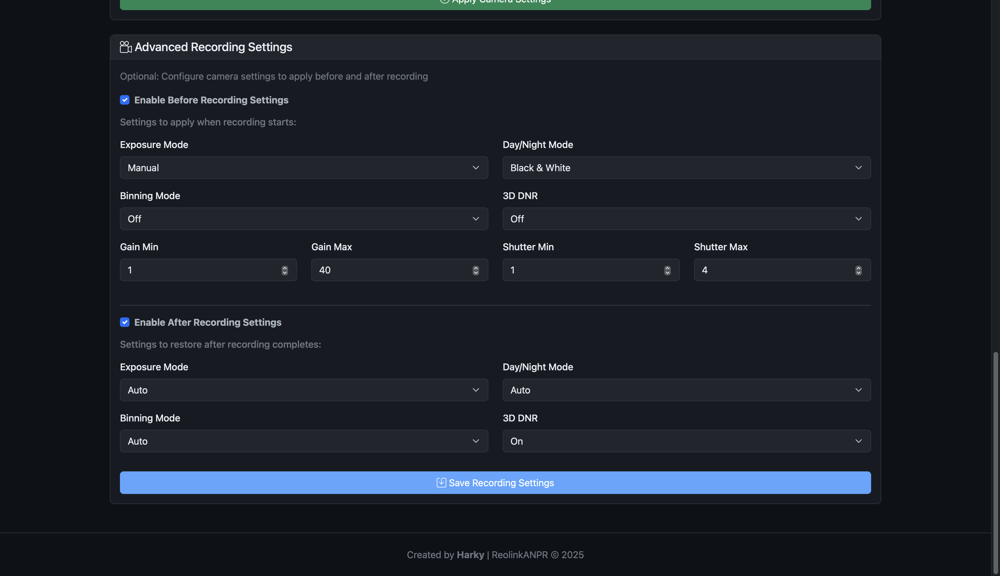

# ReolinkANPR

Automatic Number Plate Recognition (ANPR) system for Reolink cameras with AI vehicle detection.

## Screenshots

<div align="center">
  <table>
    <tr>
      <td align="center">
        
        <br/>
        <b>Dashboard</b> - Real-time detections with plate crops
      </td>
    </tr>
    <tr>
      <td align="center">
        
        <br/>
        <b>Configuration</b> - Camera & ALPR settings
      </td>
    </tr>
    <tr>
      <td align="center">
        
        <br/>
        <b>Advanced Settings</b> - Recording & notification options
      </td>
    </tr>
  </table>
</div>

## Features

- ✅ **Real-time Vehicle Detection** - Uses Reolink's built-in AI via TCP push events (Baichuan protocol)
- ✅ **Automatic License Plate Recognition** - Powered by FastALPR with YOLO detection
- ✅ **Smart Deduplication** - Prevents duplicate entries with 30-second cooldown
- ✅ **Smart Recording** - Optional camera settings optimization for plate capture
- ✅ **Web Dashboard** - Modern dark/light theme UI with plate crops and full images
- ✅ **Notifications** - Telegram & Home Assistant webhooks (automate garage doors, lights, etc.)
- ✅ **In-App Documentation** - Built-in guides for all settings
- ✅ **Zero Polling** - Event-driven architecture for instant detection
- ✅ **High Performance** - Processes 20 FPS with minimal CPU usage

## Quick Start

### Prerequisites

- **Python 3.11+** (Required for TCP push event support)
- **Reolink Camera** with AI vehicle detection enabled
- **ffmpeg** (for video recording)
  ```bash
  # Ubuntu/Debian
  sudo apt install ffmpeg python3.11 python3.11-venv
  
  # macOS
  brew install ffmpeg python@3.11
  ```

### Installation

1. **Clone the repository:**
   ```bash
   git clone https://github.com/Harky911/ReolinkANPR.git
   cd ReolinkANPR
   ```

2. **Run the setup script:**
   ```bash
   chmod +x setup.sh
   ./setup.sh
   ```
   
   This will:
   - Create a Python virtual environment
   - Install all dependencies
   - Create necessary directories
   - Generate example configuration

3. **Start the service:**
   ```bash
   python run.py
   ```

4. **Configure your camera via web UI:**
   - Open `http://localhost:5001/config`
   - Enter your camera details (IP, username, password)
   - Save and restart the service
   - All settings configurable through the web interface!

5. **Access the web dashboard:**
   ```
   http://localhost:5001
   ```

## Configuration

### Quick Setup via Dashboard

**Step 1: Access Configuration Page**
```bash
# Start the service
python run.py

# Open in your browser
http://localhost:5001/config
```

**Step 2: Configure Camera Settings**
1. **Camera Name:** Give your camera a friendly name (e.g., "Front Door")
2. **Camera IP/Host:** Enter your camera's IP address (e.g., `192.168.1.100`)
3. **Username:** Usually `admin`
4. **Password:** Your camera password (**Important:** Change from default!)
5. **Camera Channel:** 
   - `0` for standalone cameras
   - `0, 1, 2...` for NVR channels
6. **Recording Duration:** `6` seconds (adjust based on vehicle speed)

**Step 3: Configure ALPR Settings**
1. **Detection Model:** Keep default `YOLO v9 Tiny 640`
2. **OCR Model:** Keep default `CCT-S v1 Global`
3. **Min Confidence:** `0.90` (90% confidence threshold)

**Step 4: Save and Restart**
1. Click **"Save Configuration"**
2. Stop the service (Ctrl+C)
3. Restart: `python run.py`

**That's it!** Visit `http://localhost:5001` to see detections.

### Optional: Camera Control Settings

Fine-tune camera ISP settings in real-time:

1. Scroll to **"Camera Control Settings"**
2. Adjust settings and click **"Apply Camera Settings"**:
   - **Exposure Mode:** Auto (recommended) or Manual
   - **Day/Night Mode:** Black & White (recommended for plates)
   - **Gain/Shutter:** Only visible in Manual mode

**💡 Tip:** Black & White mode works best for plate reading!

### Optional: Notifications

Enable Home Assistant or Telegram notifications:

1. Scroll to **"Notifications"**
2. Check **"Enable Notifications"**
3. Configure your preferred method:
   - **Home Assistant:** Enter webhook URL
   - **Telegram:** Enter bot token and chat ID
4. Click **"Save Configuration"**

### Optional: Advanced Recording Settings

Optimize camera settings automatically during recording:

1. Scroll to **"Advanced Recording Settings"**
2. **Enable Before Recording Settings:**
   - Exposure: Manual
   - Day/Night: Black & White
   - Gain: 1-40
   - Shutter: 1-4 (fast shutter for moving vehicles)
3. **Enable After Recording Settings:**
   - Restore to Auto settings
4. Click **"Save Recording Settings"**

**💡 See In-App Documentation** (`http://localhost:5001/docs`) for detailed guides!

## Web Dashboard

The web dashboard provides:

### Main Dashboard
- Real-time detection feed
- Recent plate recognitions
- Confidence scores and timestamps
- Full-size plate images

### Configuration Page
- Camera settings management
- Real-time ISP control (exposure, gain, shutter, etc.)
- Recording settings configuration
- ALPR model selection
- **Notifications** - Configure Telegram & Home Assistant webhooks
- All settings configurable via web UI (no manual YAML editing)

### Documentation Page
- Built-in guides for every setting
- Quick tips for optimal ANPR performance
- Home Assistant automation examples
- Telegram bot setup instructions

## How It Works

1. **Event Detection** - Camera AI detects vehicle → TCP push event
2. **Recording** - System records 5-6 seconds of RTSP stream
3. **Optimization** (Optional) - Applies sharp imaging settings for plate capture
4. **Frame Extraction** - Extracts all frames from recording
5. **ALPR Processing** - FastALPR detects and reads license plates
6. **Deduplication** - Checks if same plate was detected in last 30 seconds
7. **Database Storage** - Saves plate number, confidence, full image + plate crop
8. **Notifications** - Sends to Telegram/Home Assistant (if configured)
9. **Settings Restore** (Optional) - Restores normal camera settings

## Architecture

```
┌─────────────────┐
│ Reolink Camera  │ (AI Vehicle Detection)
└────────┬────────┘
         │ TCP Push Event (Baichuan)
         ↓
┌─────────────────┐
│ Camera Client   │ (reolink_aio)
└────────┬────────┘
         │ Async
         ↓
┌─────────────────┐
│  ANPR Service   │ (Orchestration)
└────────┬────────┘
         │
    ┌────┴────┬────────┬─────────┐
    ↓         ↓        ↓         ↓
┌──────┐ ┌──────┐ ┌────────┐ ┌─────┐
│ ALPR │ │  DB  │ │  Web   │ │ Log │
└──────┘ └──────┘ └────────┘ └─────┘
FastALPR  SQLite   Flask
```

## Troubleshooting

### Camera Won't Connect

```bash
# Test camera connectivity
ping 192.168.1.100

# Check if camera is accessible
curl http://192.168.1.100
```

**RTSP Streaming:**
- RTSP is **automatically enabled** when the system connects
- If RTSP is disabled, the system will enable it on port 554
- Check logs for "RTSP enabled successfully" confirmation

### No Detections

1. **Check AI is enabled** on camera (Settings → AI → Vehicle Detection)
2. **Verify camera triggers** - wave at camera and check logs
3. **Check logs:** `tail -f logs/anpr.log`

### Settings Not Persisting

Check the in-app documentation at `http://localhost:5001/docs` for camera setup guides and troubleshooting tips.

## Development

### Project Structure

```
ReolinkANPR/
├── src/                    # Core application code
│   ├── anpr_service.py    # Main orchestration
│   ├── camera_client.py   # Reolink camera interface
│   ├── alpr_processor.py  # FastALPR integration
│   ├── database.py        # SQLite operations
│   ├── notifier.py        # Telegram & Home Assistant
│   └── logger.py          # Logging configuration
├── web/                    # Web dashboard
│   ├── app.py             # Flask application
│   ├── templates/         # HTML templates (includes docs)
│   └── static/            # CSS, JS, images
├── data/                   # Database and images
├── logs/                   # Application logs
├── config.yaml            # Configuration (gitignored)
├── config.yaml.example    # Example configuration
└── requirements.txt       # Python dependencies
```

### Running Tests

```bash
# Test dependencies
python test_dependencies.py

# Check logs
tail -f logs/anpr.log

# Test camera settings via Web UI
# Go to http://localhost:5001/config → Camera Control Settings
```

## Documentation

All documentation is now built into the web interface:
- **Installation:** Follow the Quick Start guide above
- **Configuration:** Use the web UI at `http://localhost:5001/config`
- **Settings Guide:** Visit `http://localhost:5001/docs` for complete documentation
- **Troubleshooting:** Check the in-app docs and `logs/anpr.log`

## Requirements

- **Python:** 3.11 or higher (for TCP push event support)
- **Operating System:** Linux, macOS, or Windows
- **Camera:** Reolink camera with AI vehicle detection
- **Network:** Local network access to camera

## License

MIT License - see [LICENSE](LICENSE) file for details.

## Contributing

Contributions are welcome! Please:

1. Fork the repository
2. Create a feature branch
3. Make your changes
4. Test thoroughly
5. Submit a pull request

## Use Cases

### Smart Home Automation
- **Auto-open garage** when your car arrives (via Home Assistant)
- **Turn on lights** when vehicle detected at night
- **Voice announcements** ("John is home!")
- **Different actions** for known vs unknown plates

### Security & Monitoring
- **Real-time alerts** for unexpected visitors
- **Log all vehicles** entering your property
- **Time-stamped records** with plate images
- **Search history** by plate number or date

### Simple Setup
- Web UI for all configuration (no YAML editing required)
- Built-in documentation and examples
- 30-second deduplication prevents spam
- Dark/light theme for comfortable viewing

## Acknowledgments

- [FastALPR](https://github.com/ankandrew/fast-alpr) - License plate recognition
- [reolink-aio](https://github.com/starkillerOG/reolink_aio) - Reolink camera API
- [Flask](https://flask.palletsprojects.com/) - Web framework
- Created by **Harky**

## Support

- **Issues:** [GitHub Issues](https://github.com/Harky911/ReolinkANPR/issues)
- **Documentation:** Built-in at `http://localhost:5001/docs`
- **Discussions:** [GitHub Discussions](https://github.com/Harky911/ReolinkANPR/discussions)

---

**Note:** This system is designed for personal use. Ensure compliance with local laws regarding video surveillance and data privacy.
